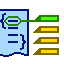

# ReviewMe
An "MSWord balloon"-style reviewer, based on ACE.

## Quick Guide
First access ReviewMe.html, either locally or through a server.

The page is structured as two panels. The left one is the *code panel*, the right one is the *review panel*.
From there, two scenarios are possible: you're either a reviewing someone's work, or your work is being reviewed by someone else.

### You are a reviewer
Copy/paste the code to be reviewed in the *code panel*, right under the header section.
Then, in the header section, set the language value accordingly to the code you are going to review.

You can now toggle the mode from *import/extract* to *review* by either pressing <kbd>ALT</kbd>+<kbd>T</kbd>, or clicking on the "Toggle Mode" button.
Once in *review* mode, the syntax highlighting should kikc in.

Once there, simply proceed to the reviewing:
1. select the piece of code (a character, a word, a line, a block, ...)
2. press <kbd>ALT</kbd>+<kbd>C</kbd> to create a *review*, or click on the "Create" button
3. for the first *review* you'll have to provide your name
4. finally type the comment you want to bind to the piece of code you just selected
5. ... and repeat

*Note: a review can be selected then deleted. More details are provided in the next part.*

*Note bis: at any moment, it is possible to reset the reviewer name by either pressing <kbd>ALT</kbd>+<kbd>R</kbd> or clicking the "Reviewer" button.*

Once done, just toggle back to *import/extract* mode by pressing <kbd>ALT</kbd>+<kbd>T</kbd> once more, or by clicking the "Toggle Mode" button. Copy the *code panel* content and send it back to whoever needs it.

### You received someone's review
Copy/paste the reviewed code in the *code panel*, therefor replacing its content.

You can now toggle the mode from *import/extract* to *review* by either pressing <kbd>ALT</kbd>+<kbd>T</kbd>, or clicking on the "Toggle Mode" button.
Once in *review* mode, the syntax highlighting should kikc in.

Once there, simply go through the reviewing by either:
* clicking on the *review* to display
* pressing <kbd>ALT</kbd>+<kbd>N</kbd> to display the next review (or by clicking the "Next" button)
* pressing <kbd>ALT</kbd>+<kbd>P</kbd> to display the previous review (or by clicking the "Previous" button)

The concerned piece of code will then be selected.

Finally, processed *reviews* can be deleted by either:
* double-clicking them
* selecting them then pressing <kbd>ALT</kbd>+<kbd>D</kbd>
* selecting them then clicking the "Delete" button

### Themes

You can switch between two themes:
* *monokai*: a dark theme (default)
* *eclipse*: a bright theme

To do so, simply hover over the "Theme" button and click one of the two options.
